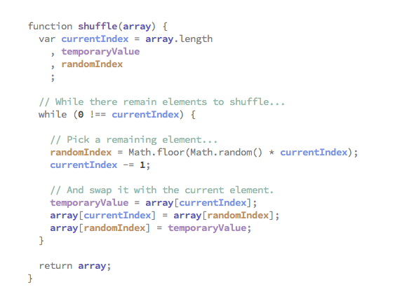

# Welcome to the Code Comprehension Research Compendium repository!

This repository aims to provide a comprehensive overview of the research on code comprehension, with a focus on syntax and semantic highlighting, visualizations, and font design. We'll explore the effects of different techniques on code comprehension, and provide practical tips for improving code reading speed and understanding.

In this repository, you will find:

- Research papers on the use of syntax and semantic highlighting in code comprehension
- Studies on the impact of visualizations
- Guidelines on the characteristics of an optimal font for maximum productivity when reading and writing code
- Practical tips for improving code reading speed and comprehension

The goal of this compendium is to provide a comprehensive resource for researchers, developers, and anyone interested in improving their code comprehension setup. We hope that the information provided here will be useful in developing new tools and techniques to make code easier to understand and work with.

We are always looking for new research and tips to add to the compendium, so if you have something to share, please feel free to make a pull request.

Thank you for visiting the repository, and happy coding!

# Syntax and Semantic Highlighting

Syntax highlighting is a feature that visually distinguishes different parts of a code file based on their syntax. For example, keywords may be displayed in a different color than variables or comments. This can make it easier for developers to read and understand code by clarifying the structure and organization of the code.

Semantic highlighting takes this one step further by coloring code based on its meaning or role within the codebase. This can help developers quickly identify important elements or understand the relationships between different parts of the code.

Semantic highlighting example [1]:

Notice how each variable is given its own color and how easy and fast it is to visually identify a variable's code path by following its color throughout the code base.

VS Code's [native](https://code.visualstudio.com/blogs/2021/09/29/bracket-pair-colorization) semantic highlighting feature doesn't yet support this type of semantic highlighting. The challenge with this type of semantic highlighting is that with an increase in variables used, we'll either have to use colors that look almost the same or reuse the same colors. On the other hand, I would argue that, in most cases, if you have so many variables to the point of running out of colors for them, you should probably refactor your code.

This feature is currently being discussed [here](https://github.com/microsoft/vscode/issues/170951#issue-1527166901).

## Research on Syntax and Semantic Highlighting

Several research studies have been conducted on syntax and semantic highlighting, including:

- "The Effect of Syntax and Semantic Highlighting on Code Reading Speed and Accuracy: An Empirical Study" (Kaya and Yildirim, 2017)
- "The Effect of Semantic Highlighting on Code Reading" (Kaya, Yildirim, and Boztug, 2016)
- ["The Impact of Syntax Colouring on Program Comprehension" (Sarkar, 2015)](https://ppig.org/files/2015-PPIG-26th-Sarkar1.pdf)
- "The Impact of Syntax Highlighting on Code Comprehension: An Empirical Study" (Bail, Murphy, and Robillard, 2013)
- "A Controlled Experiment on the Effects of Syntax Highlighting on the Comprehension of Computer Programs" (Jazayeri and Hirschberg, 2010)
- "An Empirical Study of the Effects of Syntax Highlighting on Program Comprehension" (Robillard and Murphy, 2006)

# Visualizations

Research has shown that the use of richer visualizations, such as font ligatures and the well though out combination of serif and sans-serif typefaces, can have a positive impact on code comprehension.

Font ligatures are special characters that are designed to join two or more characters together, making them appear as a single unit. They can be used to improve the readability of code by making certain character combinations, such as the double equals sign in the C programming language, more distinct. Studies have shown that the use of font ligatures can reduce the time it takes to identify errors in code and can improve overall code comprehension.

The use of serif and sans-serif typefaces in combination can also improve code readability. Serif typefaces are fonts with small lines or flourishes at the end of strokes, whereas sans-serif typefaces are fonts without those small lines. Combining serif and sans-serif can be used to distinguish certain parts of the code, making it easier to identify keywords, comments, types, and other elements.

## Research on visualizations

We welcome contributions of research on the effects of visualization techniques on code comprehension, besides the one presented:

- ["The Effect of Richer Visualizations on Code Comprehension" (Asenov, Hilliges, and Muller, 2016)](https://pm.inf.ethz.ch/publications/AsenovHilligesMueller16.pdf)

# Font characteristics for maximum code comprehension

When it comes to designing fonts for code, certain characteristics are especially important for maximum readability. The following list highlights the most important characteristics to consider when selecting a font for code:

- **Monospaced**: Programming often involves working with lines of code that are more [readable when aligned](https://www.soberkoder.com/monospace-fonts-for-code/), including columns of tabular data or with matching brackets. A monospace font (also called a fixed-width font) is a type of font in which each character has the same width, making it easier to align text in columns.
- **Distinctiveness of symbols**: Characters like "1", "l", and "I", "0", and "O", and ":", and ";", should be easily distinguishable to avoid confusion and errors.
- **Functional construction**: Simple and clean forms free from unnecessary details that can help the font look crisp and legible even in small sizes.
- **[True italics](https://www.marksimonson.com/notebook/view/FakevsTrueItalics)**: Having a clear distinction between the regular and italic form of the font can help distinguish between certain sections of code like comments and types.
- **Font ligatures**: Ligatures are special characters that are designed to join two or more characters together, making them appear as a single unit. they can be useful to improve the readability of code by making certain character combinations more distinct.
- **Small line width**: With a small line width, it's possible to have more characters per line, providing more context and easier navigation.

All of these characteristics play an important role in making a font suitable for code, and ensuring that the font is easy to read and understand. The more legible the font, the more productive and less error-prone the developer will be.

## Fonts that meet these criteria

| Name           | Sans-serif | monospaced | Ligatures                                                     | Italics | Distinctiveness of symbols                      | PowerLine symbols                                             |
| -------------- | ---------- | ---------- | ------------------------------------------------------------- | ------- | ----------------------------------------------- | ------------------------------------------------------------- |
| Operator Mono  | ✅          | ✅          | ✅ [With plugin](https://github.com/kiliman/operator-mono-lig) | ✅       |    | ✅ [With plugin](https://github.com/kiliman/operator-mono-lig) |
| JetBrains Mono | ✅          | ✅          | ✅                                                             | ✅       |  | ✅                                                             |
| Cascadia Code  | ✅          | ✅          | ✅                                                             | ✅       |    | ✅                                                             |
| Monoid         | ✅          | ✅          | ✅                                                             | ✅       |                  | ✅                                                             |
| Iosevka        | ✅          | ✅          | ✅                                                             | ✅       |                | ✅                                                             |

## Famous fonts that do not meet these criteria

| Name            | Sans-serif | monospaced | Ligatures | Italics                                                  | Distinctiveness of symbols                        | PowerLine symbols                                                                              |
| --------------- | ---------- | ---------- | --------- | -------------------------------------------------------- | ------------------------------------------------- | ---------------------------------------------------------------------------------------------- |
| Fira Code       | ✅          | ✅          | ✅         | ❌ [Issue](https://github.com/tonsky/FiraCode/issues/134) |              | ✅                                                                                              |
| Hasklig         | ✅          | ✅          | ❌         | ✅                                                        |                  | ✅                                                                                              |
| Input Mono      | ✅          | ✅          | ❌         | ✅                                                        |            | ✅                                                                                              |
| Source Code Pro | ✅          | ✅          | ❌         | ✅                                                        |  | ✅                                                                                              |
| Hack            | ✅          | ✅          | ❌         | ✅                                                        |                        | ✅                                                                                              |
| Courier Prime   | ✅          | ✅          | ❌         | ✅                                                        |      | ❌                                                                                              |
| Roboto Mono     | ✅          | ✅          | ❌         | ✅                                                        |          | ❌                                                                                              |
| Inconsolata     | ✅          | ✅          | ❌         | ❌                                                        |          | ✅ with [Inconsolata for powerline](https://github.com/powerline/fonts/tree/master/Inconsolata) |
| Monaco          | ✅          | ✅          | ❌         | ❌                                                        |                    | ❌                                                                                              |
| Droid Sans Mono | ✅          | ✅          | ❌         | ❌                                                        |  | ❌                                                                                              |

# Conclusion

Research on syntax and semantic highlighting suggests that syntax highlighting can make it easier for developers to read and understand code by clarifying the structure and organization of the code. Semantic highlighting takes this one step further by coloring code based on its meaning or role within the codebase, making it easy for developers to quickly identify important elements or understand the relationships between different parts of the code.

Visualizations such as font ligatures and the combination of serif and sans-serif typefaces, have also been shown to have a positive impact on code comprehension. These visualizations aim to increase the legibility of the code, helping developers understand and identify the code elements quickly, which leads to improved productivity and fewer errors while working with the code.

Finally, it's important to keep in mind that optimal font characteristics like monospaced, distinctiveness of symbols, functional construction, true italics with serif, font ligatures, and small line width are essential for designing a font that is easy to read and understand.

# Practical tips

To optimize code reading speed and comprehension, it is recommended to:

- Use a syntax and semantic highlighting scheme with a range of pleasing colors.
- Enable bracket pair colorization, a feature [native](https://code.visualstudio.com/blogs/2021/09/29/bracket-pair-colorization) to some code editors such as VS Code.
- Use a font that meets all the criteria for maximum code comprehension

## References
[1] The semantic highlighting example.png comes from [here](https://medium.com/@brianwill/making-semantic-highlighting-useful-9aeac92411df).

# Contributing

We are always looking for new research and tips to add to the compendium. If you have something to share, whether it's a research paper, a new visualization technique, or a productivity tip, we welcome your contributions in the form of pull requests.

Here are some guidelines for making a pull request:

- Please make sure that your contribution is relevant to the topic of code comprehension and follows the general structure of the existing content.
- If you are adding a research paper, please include a summary of the key findings.
- Please ensure that your pull request includes proper citations for any sources used.

We appreciate your contributions and thank you for helping to make this compendium a valuable resource for the code comprehension community.

If you have any questions about making a pull request, please feel free to reach out to us.
